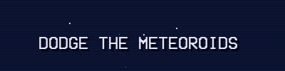

# Dodge the Meteoroids



A thrilling space survival game built with LÖVE (Love2D) where you control a spaceship dodging meteoroids and collecting power-ups!

## 🎮 Game Description

Navigate through space in your spaceship, avoiding dangerous meteoroids while collecting power-ups to survive as long as possible. Test your reflexes and see how long you can last in this fast-paced arcade-style game!

## 🚀 How to Play

### Controls

- **Arrow Keys**: Control your spaceship movement

### Gameplay

- Avoid meteoroids to stay alive
- Collect power-ups for special abilities
- Survive as long as possible to achieve a high score

## 📋 Requirements

- **LÖVE (Love2D)** framework must be installed on your system
- Download from: <https://love2d.org/>

## 🎯 How to Run

### Option 1: Using Love2D

1. Install LÖVE (Love2D) from <https://love2d.org/>
2. Navigate to the `spaceshipgame` folder
3. Run `run.bat` or drag the folder onto the Love2D executable

### Option 2: Standalone Executable

1. Navigate to the `spaceshipgame/build` folder
2. Double-click `dodge-the-meteoroids-standalone.exe`
3. No additional installation required!

## 📁 Project Structure

```text
Dodge-the-Meteoroids/
├── README.md
├── doc/
│   └── title.png
└── spaceshipgame/
    ├── main.lua              # Main game entry point
    ├── game.lua              # Core game logic
    ├── player.lua            # Player/spaceship mechanics
    ├── meteoroid.lua         # Meteoroid system
    ├── powerup.lua           # Power-up system
    ├── particlesystem.lua    # Visual effects
    ├── assetmanager.lua      # Asset loading and management
    ├── texturegenerator.lua  # Procedural texture generation
    ├── run.bat               # Quick launch script
    ├── assets/
    │   └── fonts/
    │       └── VCR_OSD_MONO_1.001.ttf
    └── build/                # Standalone executable
        └── dodge-the-meteoroids-standalone.exe
```

## 🛠️ Technical Details

- **Engine**: LÖVE (Love2D)
- **Language**: Lua
- **Version**: 1.0.0
- **Build Date**: July 15, 2025

## 🎨 Features

- Smooth mouse-controlled movement
- Procedurally generated meteoroids
- Power-up collection system
- Particle effects
- Fullscreen support
- Standalone executable included

## 📄 License

This project is licensed under the MIT License - see the [LICENSE](LICENSE) file for details.

### Third-Party Licenses

This game is built using the LÖVE (Love2D) framework and includes various third-party libraries. For detailed licensing information about the framework and its dependencies, see `spaceshipgame/build/license.txt`.

## 🎯 Development

Built with passion for arcade-style gaming. The game features modular code architecture with separate systems for game logic, player mechanics, meteoroid spawning, and visual effects.

---

**Enjoy the game and try to beat your high score!** 🚀
